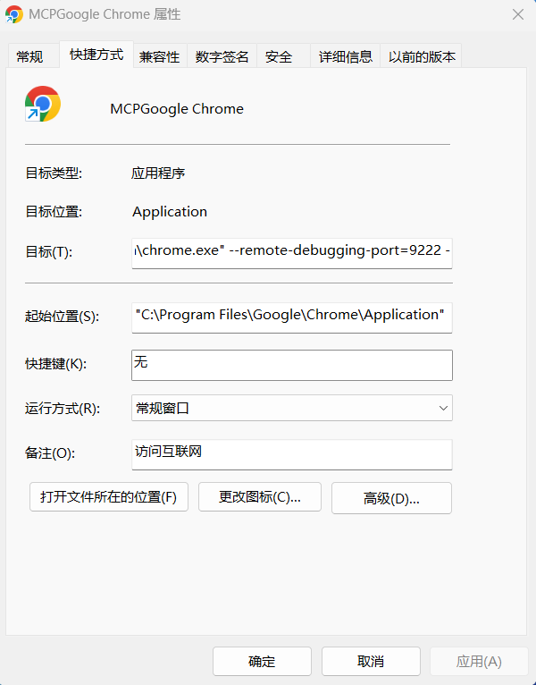
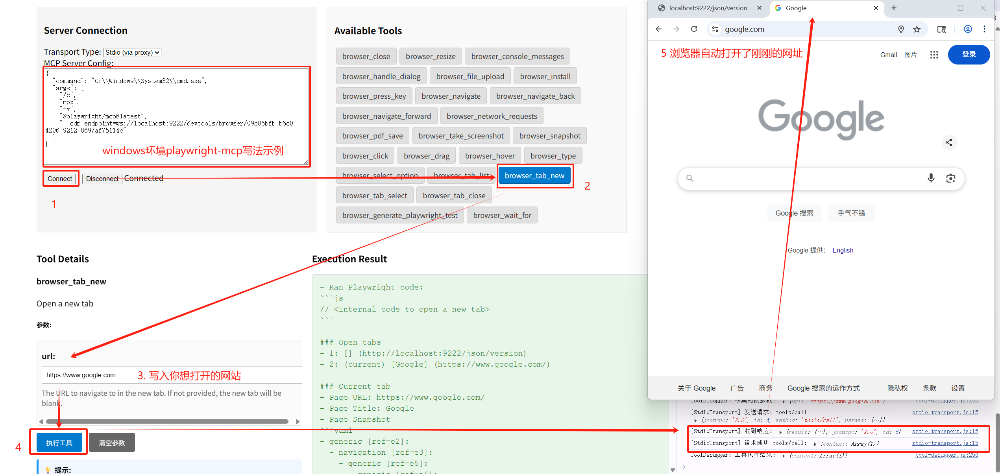

# MCP Server Debug Tool

一个基于浏览器的 MCP (Model Context Protocol) 服务器调试工具，用于测试和调试各种 MCP 服务器实现。本项目可以看作 Anthropic 官方 [Inspector](https://github.com/modelcontextprotocol/inspector) 工具的简化版本，全部代码由 Claude 生成。

## 项目结构

### 核心文件

#### `index.html`
主界面文件，包含：
- 连接配置界面（传输类型选择、服务器配置）
- 工具标签显示区域
- 工具详情和参数输入区域  
- 执行结果显示区域
- 调试功能按钮

#### `src/app.js`
应用程序主入口，包含主要方法：
- `connectServer()` - 连接 MCP 服务器
- `disconnectServer()` - 断开服务器连接
- `testConnection()` - 测试连接状态
- `showConnectionInfo()` - 显示连接详细信息
- `exportLogs()` - 导出调试日志

#### `src/core/mcp-client.js`
MCP 客户端核心类 `MCPDebugClient`，主要方法：
- `connect(transport, serverConfig)` - 建立 MCP 连接
- `initialize()` - 执行 MCP 协议握手
- `loadCapabilities()` - 加载服务器能力
- `loadTools()` - 加载工具列表
- `loadResources()` - 加载资源列表

#### `src/debugger/tool-debugger.js`
工具调试器类 `ToolDebugger`，主要方法：
- `loadTools()` - 加载并渲染工具标签
- `selectTool(tool)` - 选择工具并显示详情
- `executeTool()` - 执行选中的工具
- `collectParams()` - 收集用户输入的参数
- `displayResult(result)` - 显示执行结果
- `quickTest(toolName, params)` - 快速测试工具
- `batchTest()` - 批量测试所有工具

### 传输层实现

#### `src/transport/stdio-transport.js`
标准输入输出传输实现 `StdioTransport`，主要方法：
- `connect()` - 通过 WebSocket 代理连接到 MCP 进程
- `send(method, params)` - 发送 JSON-RPC 请求
- `sendNotification(method, params)` - 发送通知消息
- `handleMessage(event)` - 处理来自代理的响应

#### `src/transport/http-transport.js` ⚠️
HTTP 传输实现 `HTTPTransport`，主要方法：
- `send(method, params)` - 通过 HTTP POST 发送请求

#### `src/transport/websocket-transport.js` ⚠️
WebSocket 传输实现 `WebSocketTransport`，主要方法：
- `send(method, params)` - 通过 WebSocket 发送请求
- `onMessage(event)` - 处理 WebSocket 消息

#### `proxy-server.js`
Node.js 代理服务器，主要功能：
- 启动 WebSocket 服务器监听浏览器连接
- 通过 `spawn` 启动 MCP 进程
- 在浏览器和 MCP 进程间转发 JSON-RPC 消息
- 处理进程生命周期管理

## 安装指南

### 环境要求
- Node.js 14.0.0 或更高版本
- Windows 操作系统
- Chrome 浏览器

### 安装步骤

1. 克隆项目到本地：

```bash
git clone https://github.com/Peng2017/MCP-Server-DebugTool.git\ncd MCP-Server-DebugTool
```


2. 安装依赖：

```bash
npm install
```

## 使用指南

### 启动服务

1. **启动代理服务器**（在第一个终端窗口）：

```bash
npm run proxy
```

代理服务器将在端口 3001 启动，用于在浏览器和 MCP 进程间转发消息。

2. **启动 Web 服务器**（在第二个终端窗口）：

```bash
npm start
```

Web 服务器将在端口 8080 启动。

3. **打开浏览器**：

```
http://localhost:8080
```

4. **其他**：

如果是使用playwright接管chrome浏览器，可以用命令启动带参数的chrome，或者快捷方式修改为：

```
"C:\Program Files\Google\Chrome\Application\chrome.exe" --remote-debugging-port=9222 --user-data-dir="C:\Users\Admin\AppData\Local\Google\Chrome\User Data\Default"
```



这样chrome就会监听9222端口，方便playwright通过CDP endpoint接管浏览器，相应的，playwright的MCP config应该为：

```json
{
  "command": "C:\\Windows\\System32\\cmd.exe",
  "args": [
    "/c",
    "npx",
    "-y",
    "@playwright/mcp@latest",
    "--cdp-endpoint=ws://localhost:9222/devtools/browser/xxxx-xxxx-xxxx-xxxx-xxxx"
  ]
}
```

其中 ```ws://localhost:9222/devtools/browser/xxxx-xxxx-xxxx-xxxx-xxxx``` 应该替换为你在浏览器```http://localhost:9222/json/version```地址页面上看到的真实值。

### 配置说明

#### 端口配置
- **Web 服务器端口**：修改 `package.json` 中 `start` 脚本的 `-p 8080` 参数
- **代理服务器端口**：修改 `proxy-server.js` 中的 `port = 3001` 参数
- 如果修改代理端口，还需要更新 `src/transport/stdio-transport.js` 中的 `this.proxyUrl = config.proxyUrl || 'ws://localhost:3001'`

#### MCP 服务器配置
在浏览器界面的配置区域输入 MCP 服务器配置，例如：
```json
{
"command": "npx",
"args": [
"-y",
"@modelcontextprotocol/server-filesystem",
"C:/allowed/directory"
]
}
```

### 使用说明

1. **连接服务器**：
- 选择传输类型（目前推荐使用 \"stdio\"）
- 输入 MCP 服务器配置 JSON
- 点击 "Connect" 按钮

2. **测试工具**：
- 连接成功后，工具标签会自动显示
- 点击工具标签查看详情和参数
- 填写参数后点击 "执行工具" 测试

3. **调试功能**：
- `testConnection()` - 在控制台检查连接状态
- `showConnectionInfo()` - 显示详细连接信息
- `exportLogs()` - 导出调试日志
- `quickTest(toolName, params)` - 快速测试特定工具

### Chrome 调试

1. 按 F12 打开开发者工具
2. 在 Console 标签中可以：
- 查看详细的连接和执行日志
- 使用调试函数（如 `testConnection()`）
- 检查全局变量 `mcpClient` 和 `toolDebugger`
3. 在 Network 标签中可以查看 WebSocket 连接状态

## TODO

以下功能尚未完全实现：

### [HTTP Transport](src/transport/http-transport.js)
- 基础框架已实现，但缺少：
- 连接管理和状态检查
- 错误处理和重试机制
- 与 MCP 协议的完整集成
- 需要对应的 HTTP MCP 服务器支持

### [WebSocket Transport](src/transport/websocket-transport.js)
- 基础框架已实现，但缺少：
- `connect()` 方法实现
- 连接状态管理
- 错误处理和重连逻辑
- 消息队列和超时处理
- 需要对应的 WebSocket MCP 服务器支持

目前项目主要支持通过 stdio 传输与 MCP 服务器通信，这是最常见和稳定的连接方式。

## 运行截图


